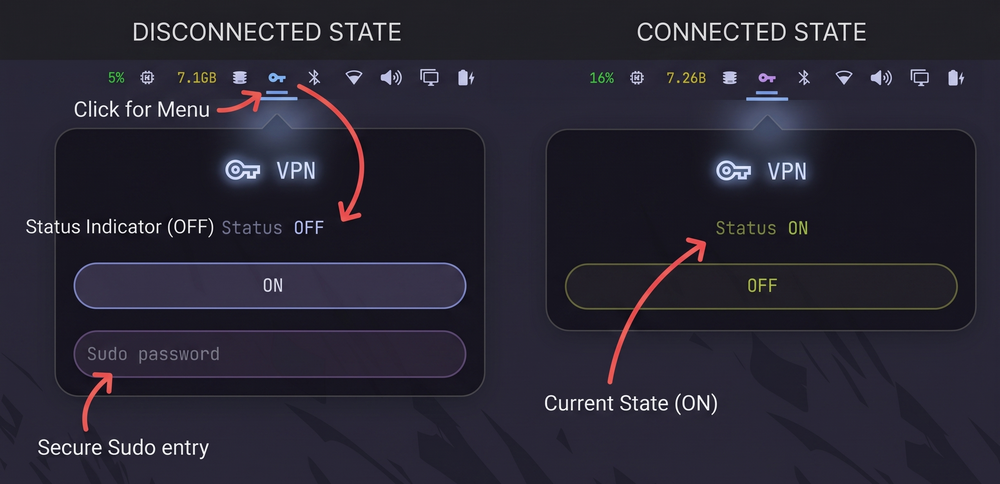

# wg-omarchy

A WireGuard VPN toggle for the [Omarchy](https://omarchy.org) shell bar.

Shows a lock icon in the bar (dim when off, bright when on). Clicking it opens
a panel with a live ON/OFF status, a toggle button, and an inline sudo password
prompt. It drives `sudo wg-quick up wg0` / `sudo wg-quick down wg0`.

## Screenshots




## Install

```bash
omarchy plugin add https://github.com/<your-user>/wg-omarchy.git --enable
```

Or develop locally:

```bash
ln -s ~/Projects/wg-omarchy ~/.config/omarchy/plugins/wg-omarchy
omarchy-shell shell rescanPlugins
omarchy plugin enable wg-omarchy
omarchy bar move wg-omarchy --section right
```

## Requirements

- `wireguard-tools` (`wg-quick`)
- A WireGuard config at `/etc/wireguard/wg0.conf`
- Passwordless-not-required sudo (the panel prompts for your sudo password)

## How it works

- **Status** — `ip link show | grep -E 'tun|tap|wg|ppp'` every 5s; any tunnel
  interface means "on".
- **Toggle** — `sudo -S wg-quick up wg0` / `sudo -S wg-quick down wg0`, with the
  password piped over stdin (never on the command line) and cleared after use.
